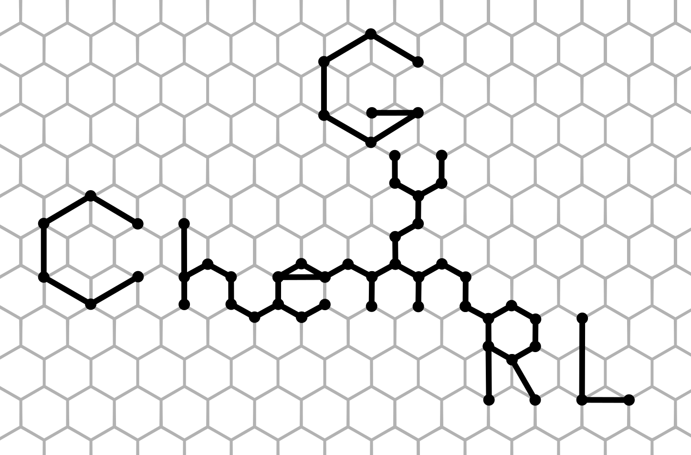

.. chemistrygym documentation master file, created by
   sphinx-quickstart on Wed Jun  7 16:48:37 2023.
   You can adapt this file completely to your liking, but it should at least
   contain the root `toctree` directive.

Welcome to ChemGymRL's documentation!
=======================================

On this page you will find all of our documentation for ChemGymRL, explaining how the software works, how to install it, and offering explanations and tutorials for each of the individual benches.  

Our documentation is also available via github `here <https://github.com/chemgymrl/chemgymrl/tree/main/docs>`_. If you see an issue with any of the documentation or the code presented in the following pages, feel free to contact us and let us know, or issue a pull request and one of the members of our team will take a look at it!

.. toctree::
   :maxdepth: 1
   :caption: Documentation:

   chemistrylab

.. toctree::
   :maxdepth: 1
   :caption: Getting Started:
   
   WhatIsChemGymRL
   Installation
   QuickStart

.. toctree::
   :maxdepth: 1
   :caption: User Manual:

   reaction
   extraction
   distillation
   characterization
   Developers
   Glossary
   Troubleshooting

.. toctree::
   :maxdepth: 1
   :caption: Tutorials:

   vessel_lesson
   lesson_1_react
   custom_reaction_lesson
   lesson_1_extract
   custom_extraction_lesson
   lesson_1_distillation

.. toctree::
   :maxdepth: 1
   :caption: Contact:

   Contact
   License

Indices and tables
==================

* :ref:`genindex`
* :ref:`search`
